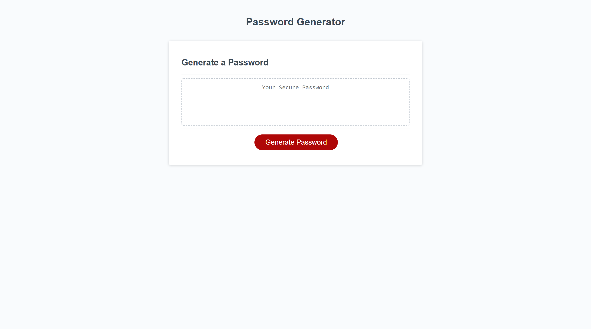

Contact: Gene Grove - gwg1387@gmail.com

<br>

Associated Links

GIT Pages Link: https://ggrove87.github.io/HW3-Password-Generator/

GIT Repository Link: https://github.com/ggrove87/HW3-Password-Generator

<br>

## User Story

```
AS AN employee with access to sensitive data
I WANT to randomly generate a password that meets certain criteria
SO THAT I can create a strong password that provides greater security
```

## Acceptance Criteria

```
GIVEN I need a new, secure password
WHEN I click the button to generate a password
THEN I am presented with a series of prompts for password criteria
WHEN prompted for password criteria
THEN I select which criteria to include in the password
WHEN prompted for the length of the password
THEN I choose a length of at least 8 characters and no more than 128 characters
WHEN asked for character types to include in the password
THEN I confirm whether or not to include lowercase, uppercase, numeric, and/or special characters
WHEN I answer each prompt
THEN my input should be validated and at least one character type should be selected
WHEN all prompts are answered
THEN a password is generated that matches the selected criteria
WHEN the password is generated
THEN the password is either displayed in an alert or written to the page
```

<br>

## Mock-Up

The following image shows the web application's appearance and functionality:

<br>
Appearance Image:



Functionality Image:

